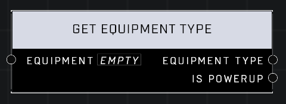

# Get Equipment Type

## Description
Returns the *Equipment Type* of the *Equipment* object.

## Node Type
Nodes fall into two basic categories: Data and Execution. This node supplies Data for an Execution node.

## Inputs
| Input | Type | Required | Description |
|------------------|------------------|----------|--------------------------------------------------------------|
| Equipment | Object | Yes | Which equipment to get type from. |

## Outputs
| Output | Type | Description |
|------------------|------------------|--------------------------------------------------------------|
| Equipment Type | Equipment Type | What type of equipment it is. |
| Is Powerup | Boolean | True if the equipment came from a powerup. |

\
\
**Contributors**

AddiCt3d 2CHa0s