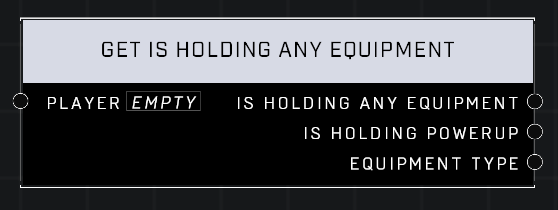

# Get Is Holding Any Equipment

## Description
Returns true if the *Player* is holding any equipment. Additional pins provide some details about the equipment held.

## Node Type
Nodes fall into two basic categories: Data and Execution. This node supplies Data for an Execution node.

## Inputs
| Input | Type | Required | Description |
|------------------|------------------|----------|--------------------------------------------------------------|
| Player | Object | Yes | Which player to check for equipment. |

## Outputs
| Output | Type | Description |
|------------------|------------------|--------------------------------------------------------------|
| Is Holding Any Equipment | Boolean | True if player is holding an equipment. |
| Is Holding Powerup | Boolean | True if equipment player is holding was a powerup. |
| Equipment Type | Equipment Type | What type of equipment it is. |

\
\
**Contributors**

AddiCt3d 2CHa0s