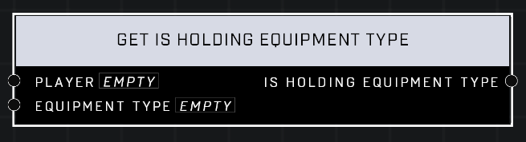

# Get Is Holding Equipment Type

## Description
Returns true if the *Player* is holding equipment matching the *Equipment Type*

## Node Type
Nodes fall into two basic categories: Data and Execution. This node supplies Data for an Execution node.

## Inputs
| Input | Type | Required | Description |
|------------------|------------------|----------|--------------------------------------------------------------|
| Player | Object | Yes | Which player to check for equipment. |
| Equipment Type | Equipment Type | Yes | Which type of equipment to check for. |

## Outputs
| Output | Type | Description |
|------------------|------------------|--------------------------------------------------------------|
| Is Holding Equipment Type | Boolean | True if the player is holding that equipment type. |

\
\
**Contributors**

AddiCt3d 2CHa0s