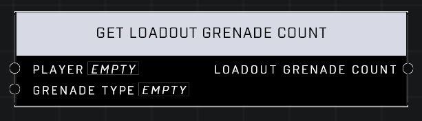

# Get Loadout Grenade Count

## Description
Get the number of grenades of the *Grenade Type* that the *Player* will currently respawn with. This number may change throughout the game as traits or other modifiers are applied.

## Node Type
Nodes fall into two basic categories: Data and Execution. This node supplies Data for an Execution node.

## Inputs
| Input | Type | Required | Description |
|------------------|------------------|----------|--------------------------------------------------------------|
| Player | Object | Yes | Which player to check grenades. |
| Grenade Type | Grenade Type | Yes | Which type of grenade to check for. |

## Outputs
| Output | Type | Description |
|------------------|------------------|--------------------------------------------------------------|
| Loadout Grenade Count | Number | How many grenades of that type player will respawn with. |

\
\
**Contributors**

AddiCt3d 2CHa0s