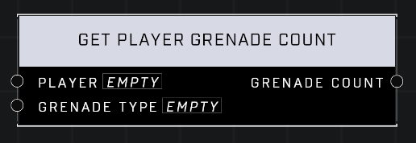

# Get Player Grenade Count

## Description
Returns the number of grenades of the *Grenade Type* held by the *Player*

## Node Type
Nodes fall into two basic categories: Data and Execution. This node supplies Data for an Execution node.

## Inputs
| Input | Type | Required | Description |
|------------------|------------------|----------|--------------------------------------------------------------|
| Player | Object | Yes | Which player to check grenade count on. |
| Grenade Type | Grenade Type | Yes | Which type of grenades to check for.

## Outputs
| Output | Type | Description |
|------------------|------------------|--------------------------------------------------------------|
| Grenade Count | Number | How many grenades of they type player is holding. |

\
\
**Contributors**

AddiCt3d 2CHa0s