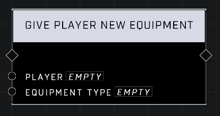

# Give Player New Equipment

## Description
Attempts to create a new equipment instance of the *Equipment Type* and add it to the *Player*'s inventory, deleting any existing equipment

## Node Type
Nodes fall into two basic categories: Data and Execution. This node Executes a function directly in the node string.

## Inputs
| Input | Type | Required | Description |
|------------------|------------------|----------|--------------------------------------------------------------|
| Player | Object | Yes | Which player to give ammo to. |
| Equipment Type | Equipment Type | Yes | Which type of equipment to give to player |

## Outputs
| Output | Type | Description |
|------------------|------------------|--------------------------------------------------------------|
| N/A | N/A | N/A |

\
\
**Contributors**

AddiCt3d 2CHa0s
