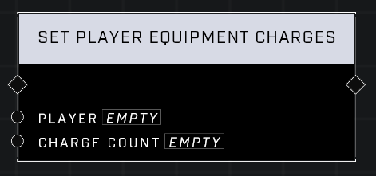

# Set Player Equipment Charges

## Description
Sets the equipment charges in a *Player*'s inventory to the *Charge Count*

## Node Type
Nodes fall into two basic categories: Data and Execution. This node Executes a function directly in the node string.

## Inputs
| Input | Type | Required | Description |
|------------------|------------------|----------|--------------------------------------------------------------|
| Player | Object | Yes | Which player to give equipment charges to. |
| Charge Count | Number | Yes | How many equipment charges to give to player. |

## Outputs
| Output | Type | Description |
|------------------|------------------|--------------------------------------------------------------|
| N/A | N/A | N/A |

\
\
**Contributors**

AddiCt3d 2CHa0s
