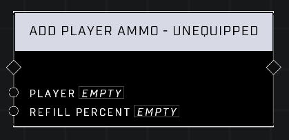

# Add Player Ammo - Unequipped

## Description
Adds a percentage of total ammo to the weapon the Player has in their backpack. Refill Percent takes a value between 0 and 100.

## Node Type
Nodes fall into two basic categories: Data and Execution. This node Executes a function directly in the node string.

## Inputs
| Input | Type | Required | Description |
|------------------|------------------|----------|--------------------------------------------------------------|
| Player | Object | Yes | Which player to give ammo to. |
| Refill Percent | Number | Yes | What percentage of weapon's total ammo to add to the weapon. |

## Outputs
| Output | Type | Description |
|------------------|------------------|--------------------------------------------------------------|
| N/A | N/A | N/A |

\
\
**Contributors**

AddiCt3d 2CHa0s
