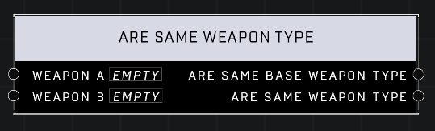

# Are Same Weapon Type

## Description
Returns whether the two objects share a base Weapon Type (e.g both are Gravity Hammers) and if they share a Weapon Type (e.g. both are Rushdown Gravity Hammers). Two objectrs with invalid Weapon Types will be compared as true.

## Node Type
Nodes fall into two basic categories: Data and Execution. This node supplies Data for an Execution node.

## Inputs
| Input | Type | Required | Description |
|------------------|------------------|----------|--------------------------------------------------------------|
| Weapon A | Object | Yes | A weapon to compare Type to. |
| Weapon B | Object | Yes | A weapon to compare Type to. |

## Outputs
| Output | Type | Description |
|------------------|------------------|--------------------------------------------------------------|
| Are Same Base Weapon Type | Boolean | Is true if both weapons are same base weapon type (less specific). |
| Are Same Weapon Type | Boolean | Is true if both weapons are same weapon type (more specific). |

\
\
**Contributors**

AddiCt3d 2CHa0s
