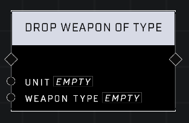

# Drop Weapon Of Type

## Description
Have the Player attempt to drop the first weapon in their inventory that matches the Weapon Type if it exists

## Node Type
Nodes fall into two basic categories: Data and Execution. This node Executes a function directly in the node string.

## Inputs
| Input | Type | Required | Description |
|------------------|------------------|----------|--------------------------------------------------------------|
| Player | Object | Yes | Which player will drop weapon. |
| Weapon Type | Weapon Type | Yes | Player drops first weapon of this type if they're carrying it. |

## Outputs
| Output | Type | Description |
|------------------|------------------|--------------------------------------------------------------|
| N/A | N/A | N/A |

\
\
**Contributors**

AddiCt3d 2CHa0s
