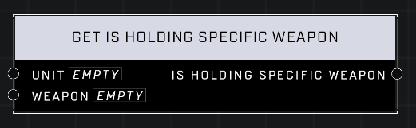

# Get Is Holding Specific Weapon

## Description
Returns true if the Player has a particular Weapon instance in their inventory

## Node Type
Nodes fall into two basic categories: Data and Execution. This node supplies Data for an Execution node.

## Inputs
| Input | Type | Required | Description |
|------------------|------------------|----------|--------------------------------------------------------------|
| Unit | Object | Yes | Which unit is holding the weapon. |
| Weapon | Object | Yes | The specific weapon to search for. |

## Outputs
| Output | Type | Description |
|------------------|------------------|--------------------------------------------------------------|
| Is Holding Specific Weapon | Boolean | True if the unit is holding the weapon. |

\
\
**Contributors**

AddiCt3d 2CHa0s