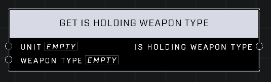

# Get Is Holding Weapon Type

## Description
Returns true if the Player has a weapon in their inventory that matches the Weapon Type

## Node Type
Nodes fall into two basic categories: Data and Execution. This node supplies Data for an Execution node.

## Inputs
| Input | Type | Required | Description |
|------------------|------------------|----------|--------------------------------------------------------------|
| Unit | Object | Yes | Which unit to check if holding the weapon type. |
| Weapon Type | Weapon Type | Yes | The weapon type to check if player is holding. |

## Outputs
| Output | Type | Description |
|------------------|------------------|--------------------------------------------------------------|
| Is Holding Weapon Type | Boolean | True if unit is holding a weapon of this type. |

\
\
**Contributors**

AddiCt3d 2CHa0s