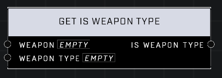

# Get Is Weapon Type

## Description
Returns true if the Weapon matches the Weapon Type

## Node Type
Nodes fall into two basic categories: Data and Execution. This node supplies Data for an Execution node.

## Inputs
| Input | Type | Required | Description |
|------------------|------------------|----------|--------------------------------------------------------------|
| Weapon | Object | Yes | Which weapon to check weapon type. |
| Weapon Type | Weapon Type | Yes | The weapon type to check for of weapon. |

## Outputs
| Output | Type | Description |
|------------------|------------------|--------------------------------------------------------------|
| Is Weapon Type | Boolean | True if weapon matches the type. |

\
\
**Contributors**

AddiCt3d 2CHa0s