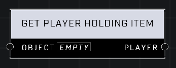

# Get Player Holding Item

## Description
Returns the player who has the Object in their inventory. Returns an invalid reference if the Object is not in any player's inventory.

## Node Type
Nodes fall into two basic categories: Data and Execution. This node supplies Data for an Execution node.

## Inputs
| Input | Type | Required | Description |
|------------------|------------------|----------|--------------------------------------------------------------|
| Object | Object | Yes | The object to check if any player is holding it. |

## Outputs
| Output | Type | Description |
|------------------|------------------|--------------------------------------------------------------|
| Player | Object | Outputs player that is holding the object or invalid. |

\
\
**Contributors**

AddiCt3d 2CHa0s