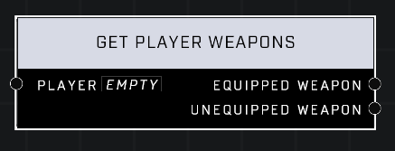

# Get Player Weapons

## Description
Returns object references to the weapons in the Player's inventory. Pins return an invalid reference if the Player does not have a weapon.

## Node Type
Nodes fall into two basic categories: Data and Execution. This node supplies Data for an Execution node.

## Inputs
| Input | Type | Required | Description |
|------------------|------------------|----------|--------------------------------------------------------------|
| Player | Object | Yes | The player to get weapons for. |

## Outputs
| Output | Type | Description |
|------------------|------------------|--------------------------------------------------------------|
| Equipped Weapon | Object | Player's equipped weapon if it exists. |
| Unquipped Weapon | Object | Player's unequipped weapon if it exists. |

\
\
**Contributors**

AddiCt3d 2CHa0s