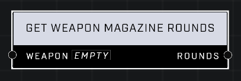

# Get Weapon Magazine Rounds

## Description
Returns the number of rounds in the Weapon magazine. Returns 0 if the weapon does not have a magazine.

## Node Type
Nodes fall into two basic categories: Data and Execution. This node supplies Data for an Execution node.

## Inputs
| Input | Type | Required | Description |
|------------------|------------------|----------|--------------------------------------------------------------|
| Weapon | Object | Yes | Which weapon to check how many rounds it currently has. |

## Outputs
| Output | Type | Description |
|------------------|------------------|--------------------------------------------------------------|
| Rounds | Number | Total number of rounds weapon currently has. |

\
\
**Contributors**

AddiCt3d 2CHa0s