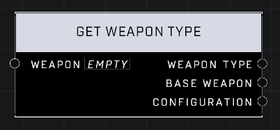

# Get Weapon Type

## Description
Returns the Weapon Type of the input object

## Node Type
Nodes fall into two basic categories: Data and Execution. This node supplies Data for an Execution node.

## Inputs
| Input | Type | Required | Description |
|------------------|------------------|----------|--------------------------------------------------------------|
| Weapon | Object | Yes | Weapon to check type of. |

## Outputs
| Output | Type | Description |
|------------------|------------------|--------------------------------------------------------------|
| Weapon Type | Weapon Type | The weapon's type (more specific) |
| Base Weapon | Weapon Type | The weapon's base type (less specific) |
| Configuration |  |  |

\
\
**Contributors**

AddiCt3d 2CHa0s