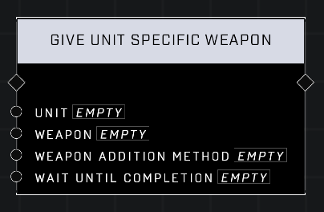

# Give Unit Specific Weapon

## Description
Attempts to add a specific Weapon instance to the Unit's inventory. Optionally blocks script execution until the operation is finished. If the unit is in a vehicle, this function is ignored.

## Node Type
Nodes fall into two basic categories: Data and Execution. This node Executes a function directly in the node string.

### Inputs
| Input | Type | Required | Description |
|------------------|------------------|----------|--------------------------------------------------------------|
| Unit | Object | Yes | Which unit to give weapon to. |
| Weapon | Object | Yes | Which weapon to give to unit. |
| Weapon Addition Method | | Yes | |
| Wait Until Completion | Boolean | Yes | |

## Outputs
| Output | Type | Description |
|------------------|------------------|--------------------------------------------------------------|
| N/A | N/A | N/A |

\
\
**Contributors**

AddiCt3d 2CHa0s
