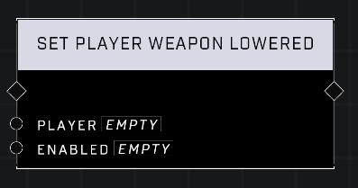

# Set Player Weapon Lowered

## Description
Set Enabled to true to lower the Player's weapons. Warning! Switching weapons without calling the node will raise the weapon in third-person, but not first-person.

## Node Type
Nodes fall into two basic categories: Data and Execution. This node Executes a function directly in the node string.

## Inputs
| Input | Type | Required | Description |
|------------------|------------------|----------|--------------------------------------------------------------|
| Player | Object | Yes | Which player to lower or raise weapon for. |
| Enabled | Boolean | Yes | If true, weapon will lower, if false, weapon will return to default. |

## Outputs
| Output | Type | Description |
|------------------|------------------|--------------------------------------------------------------|
| N/A | N/A | N/A |

\
\
**Contributors**

AddiCt3d 2CHa0s
