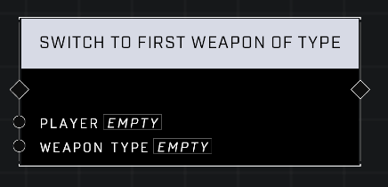

# Switch To First Weapon Of Type

## Description
Force the Player to switch to the first weapon in their inventory that matches the Weapon Type. Has no effect if the Player already has that weapon equipped or does not have a matching weapon.

## Node Type
Nodes fall into two basic categories: Data and Execution. This node Executes a function directly in the node string.

## Inputs
| Input | Type | Required | Description |
|------------------|------------------|----------|--------------------------------------------------------------|
| Player | Object | Yes | Which player to switch weapons for. |
| Weapon Type | Weapon Type | Yes | Weapon Type to switch to if player has it. |

## Outputs
| Output | Type | Description |
|------------------|------------------|--------------------------------------------------------------|
| N/A | N/A | N/A |

\
\
**Contributors**

AddiCt3d 2CHa0s
