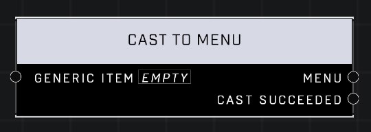

# Cast To Menu

## Description
Converts a _Generic Item_ to a _Menu_. Incompatibility will result in invalid output.  

## Node Type
Nodes fall into two basic categories: Data and Execution. This node supplies Data for an Execution node.

## Inputs
| Input | Type | Required | Description |
|------------------|------------------|----------|--------------------------------------------------------------|
| Generic Item | Item | Yes | Node sets this Item to it's Type. |

## Outputs
| Output | Type | Description |
|------------------|------------------|--------------------------------------------------------------|
| Menu | Menu | The item outputs as this Type. |
| Cast Succeeded | Boolean | True if the item successfully output as the Type. |

\
\
**Contributors**

AddiCt3d 2CHa0s \
Okom \
Jordan9232