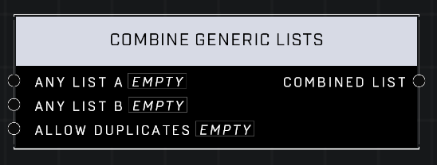

# Combine Generic Lists

## Description
Combines Any Lists, optionally allowing for duplicate entries from Any List B to remain in the new list.

## Node Type
Nodes fall into two basic categories: Data and Execution. This node Executes a function directly in the node string.

## Inputs
| Input | Type | Required | Description |
|------------------|------------------|----------|--------------------------------------------------------------|
| Any List | List | Yes | Which list to add item to. |
| Any | (anything) | Yes | The thing being added to the list. |
| Allow Duplicates | Boolean | Yes | Whether or not more than one of the thing can exist in the list. |

## Outputs
| Output | Type | Description |
|------------------|------------------|--------------------------------------------------------------|
| Generic List | Generic List | The new list after adding the thing to the list. |

\
\
**Contributors**

AddiCt3d 2CHa0s