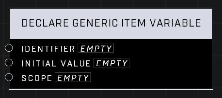

# Declare Generic Item Variable

## Description
Declare a Generic Item variable with a custom Identifier. Variable declarations do not require an event node to trigger. They are automatically performed when the node graph script is run.

## Node Type
Nodes fall into two basic categories: Data and Execution. This node Executes a function when the game loads.

## Inputs
| Input | Type | Required | Description |
|------------------|------------------|----------|--------------------------------------------------------------|
| Identifier | String | Yes | The string id for this variable. |
| Initial Value | (anything) | No | What the variable holds when the game starts. |
| Scope | Scope | Yes | Determines if this item can be accessed by other brains, and what the item is associated with. |

## Outputs
| Output | Type | Description |
|------------------|------------------|--------------------------------------------------------------|
| N/A | N/A | N/A |

\
\
**Contributors**

AddiCt3d 2CHa0s