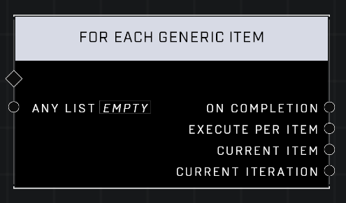

# For Each Generic Item

## Description
Execute connected functions for each item in Any List

## Node Type
Nodes fall into two basic categories: Data and Execution. This node Executes a function directly in the node string.

## Inputs
| Input | Type | Required | Description |
|------------------|------------------|----------|--------------------------------------------------------------|
| Any List | List | Yes | Which list this node will loop through for it's functions. |

## Outputs
| Output | Type | Description |
|------------------|------------------|--------------------------------------------------------------|
| On Completion | Execution | Continues the node string after looping through the list and executing functions. |
| Execute Per Item | Execution | Runs the attached node string for each item in the list. |
| Current Item | item | The item at the current index while looping through the list. |
| Current Iteration | Number | The current index while looping through the list. |

\
\
**Contributors**

AddiCt3d 2CHa0s