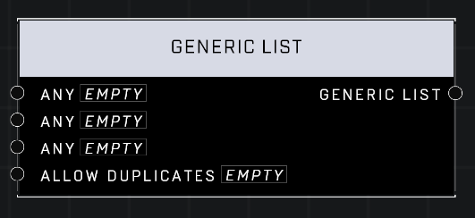

# Generic List

## Description
Creates a Generic List out of Any non-identifier items, optionally allowing for duplicate entries to be added. If an item is also a list, its entries will be individually added into the result.

## Node Type
Nodes fall into two basic categories: Data and Execution. This node supplies Data for an Execution node.

## Inputs
| Input | Type | Required | Description |
|------------------|------------------|----------|--------------------------------------------------------------|
| Any | item | No | Any item in the game accessible to nodes. |
| Any | item | No | Any item in the game accessible to nodes. |
| Any | item | No | Any item in the game accessible to nodes. |
| Allow Duplicates | Boolean | Yes | Whether or not more than one of a same thing can exist in the list. |

## Outputs
| Output | Type | Description |
|------------------|------------------|--------------------------------------------------------------|
| Generic List | Generic List | A list containing generic items, not categorized by type. |

\
\
**Contributors**

AddiCt3d 2CHa0s