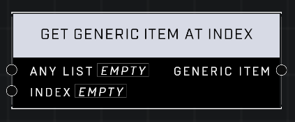

# Get Generic Item At Index

## Description
Gets the item stored at the Index of Any List. Returns an invalid item if the index is out of bounds. List indices start at 1.

## Node Type
Nodes fall into two basic categories: Data and Execution. This node supplies Data for an Execution node.

## Inputs
| Input | Type | Required | Description |
|------------------|------------------|----------|--------------------------------------------------------------|
| Any List | List | Yes | Any list type. |
| Index | Number | Yes | The index number used to retrieve item from list. |

## Outputs
| Output | Type | Description |
|------------------|------------------|--------------------------------------------------------------|
| Generic Item | Generic Item | The item that is located at that index. |

\
\
**Contributors**

AddiCt3d 2CHa0s