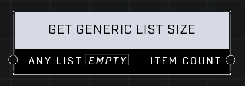

# Get Generic List Size

## Description
Gets the number of items contained in Any List

## Node Type
Nodes fall into two basic categories: Data and Execution. This node supplies Data for an Execution node.

## Inputs
| Input | Type | Required | Description |
|------------------|------------------|----------|--------------------------------------------------------------|
| Any List | List | Yes | List to get size of. |

## Outputs
| Output | Type | Description |
|------------------|------------------|--------------------------------------------------------------|
| Item Count | Number | Count of items in this list. |

\
\
**Contributors**

AddiCt3d 2CHa0s