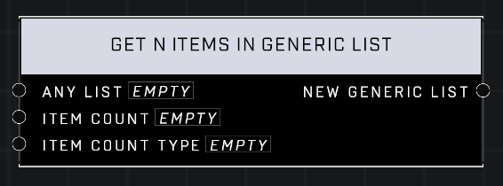

# Get N Items In Generic List

## Description
Gets the first, last, or random N items from Any List based off the Item Count Type

## Node Type
Nodes fall into two basic categories: Data and Execution. This node supplies Data for an Execution node.

## Inputs
| Input | Type | Required | Description |
|------------------|------------------|----------|--------------------------------------------------------------|
| Any List | List | Yes | Which list to add item to. |
| Item Count | Number | Yes | How many items to get from the list. |
| Item Count Type | Count Type | Yes | Choose to grab how many first, last, or random items. |

## Outputs
| Output | Type | Description |
|------------------|------------------|--------------------------------------------------------------|
| New Generic List | Generic List | A new list also holding items grabbed from this list. |

\
\
**Contributors**

AddiCt3d 2CHa0s