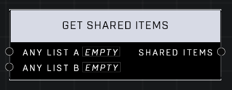

# Get Shared Items

## Description
Returns all items in Any List A that also appear in Any List B

## Node Type
Nodes fall into two basic categories: Data and Execution. This node supplies Data for an Execution node.

## Inputs
| Input | Type | Required | Description |
|------------------|------------------|----------|--------------------------------------------------------------|
| Any List A | List | Yes | A list to compare items to. |
| Any List B | List | Yes | A list to compare items to. |

## Outputs
| Output | Type | Description |
|------------------|------------------|--------------------------------------------------------------|
| Shared Items | List | A new list also containing items that exist in both lists. |

\
\
**Contributors**

AddiCt3d 2CHa0s