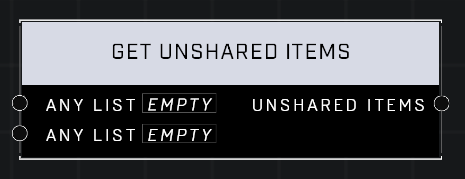

# Get Unshared Items

## Description
Returns a list of items that appear in only one of the Any Lists

## Node Type
Nodes fall into two basic categories: Data and Execution. This node supplies Data for an Execution node.

## Inputs
| Input | Type | Required | Description |
|------------------|------------------|----------|--------------------------------------------------------------|
| Any List | List | Yes | A list to compare items to. |
| Any List | List | Yes | A list to compare items to. |

## Outputs
| Output | Type | Description |
|------------------|------------------|--------------------------------------------------------------|
| Unshared Items | List | A new list also containing any items that only exist in one of the lists. |

\
\
**Contributors**

AddiCt3d 2CHa0s