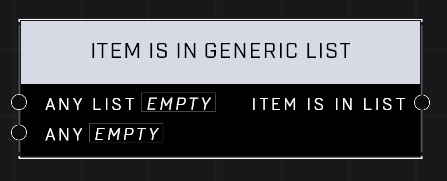

# Item Is In Generic List

## Description
Returns whether the Any List includes the Any non-Identifier item. If the item is also a list, its entries will be individually searched for the node will return true if all of them are found.

## Node Type
Nodes fall into two basic categories: Data and Execution. This node supplies Data for an Execution node.

## Inputs
| Input | Type | Required | Description |
|------------------|------------------|----------|--------------------------------------------------------------|
| Any List | List | Yes | A list to check for item. |
| Any | Item | Yes | Which item to check list for. |

## Outputs
| Output | Type | Description |
|------------------|------------------|--------------------------------------------------------------|
| Item Is In List | Boolean | True if item is in the list. |

\
\
**Contributors**

AddiCt3d 2CHa0s