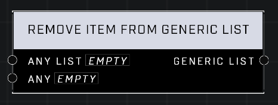

# Remove Item From Generic List

## Description
Removes all items in Any List that match the Any non-Identifier item. If the item is also a list, its entries will be individually searched for and removed.

## Node Type
Nodes fall into two basic categories: Data and Execution. This node Executes a function directly in the node string.

## Inputs
| Input | Type | Required | Description |
|------------------|------------------|----------|--------------------------------------------------------------|
| Any List | List | Yes | The list to remove item from. |
| Any | Item | Yes | Which item to remove from the list. |

## Outputs
| Output | Type | Description |
|------------------|------------------|--------------------------------------------------------------|
| Generic List | Generic List | New list after item is removed. |

\
\
**Contributors**

AddiCt3d 2CHa0s