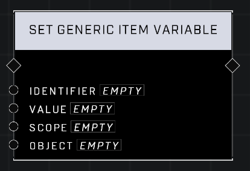

# Set Generic Item Variable

## Description
Set the Generic Item variable stored with the matching identifier in the matching Scope. The Object pin is only used when accessing the Object scope.

## Node Type
Nodes fall into two basic categories: Data and Execution. This node Executes a function directly in the node string.

## Inputs
| Input | Type | Required | Description |
|------------------|------------------|----------|--------------------------------------------------------------|
| Identifier | String | Yes | The string id of the variable to set. |
| Value | Item | Yes | What item to set the variable as. |
| Scope | Scope | Yes | Determines if this item can be accessed by other brains, and what the item is associated with. |
| Object | Object | No | If Scope is Object, which object this variable is associated to.

## Outputs
| Output | Type | Description |
|------------------|------------------|--------------------------------------------------------------|
| N/A | N/A | N/A |

\
\
**Contributors**

AddiCt3d 2CHa0s