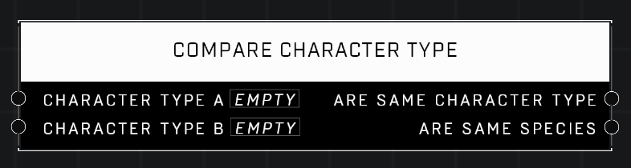

# Compare Character Type

## Description
Compares two Character Types and the species they belong to

## Node Type
Nodes fall into two basic categories: Data and Execution. This node supplies Data for an Execution node.

## Inputs
| Input | Type | Required | Description |
|------------------|------------------|----------|--------------------------------------------------------------|
| Character Type A | Character Type | Yes | Character Type to compare to other input. |
| Character Type B | Character Type | Yes | Character Type to compare to other input. |

## Outputs
| Output | Type | Description |
|------------------|------------------|--------------------------------------------------------------|
| Are Same Character Type | Boolean | Outputs TRUE if both character types are the same. |
| Are Same Character Type | Boolean | Outputs TRUE if both character types are the same species. |

\
\
**Contributors**

AddiCt3d 2CHa0s