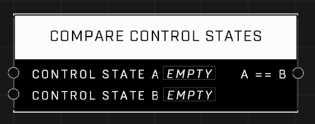

# Compare Control States

## Description
Compares two Control State values

## Node Type
Nodes fall into two basic categories: Data and Execution. This node supplies Data for an Execution node.

## Inputs
| Input | Type | Required | Description |
|------------------|------------------|----------|--------------------------------------------------------------|
| Control State A | Control State | Yes | Control State to compare to other input. |
| Control State B | Control State | Yes | Control State to compare to other input. |

## Outputs
| Output | Type | Description |
|------------------|------------------|--------------------------------------------------------------|
| A == B | Boolean | Outputs TRUE if both Control States are the same. |

\
\
**Contributors**

AddiCt3d 2CHa0s