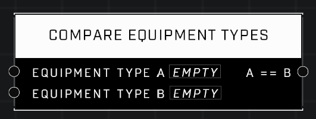

# Compare Equipment Types

## Description
Compares two Equipment Type values

## Node Type
Nodes fall into two basic categories: Data and Execution. This node supplies Data for an Execution node.

## Inputs
| Input | Type | Required | Description |
|------------------|------------------|----------|--------------------------------------------------------------|
| Equipment Type A | Equipment Type | Yes | Equipment Type to compare to other input. |
| Equipment Type B | Equipment Type | Yes | Equipment Type to compare to other input. |

## Outputs
| Output | Type | Description |
|------------------|------------------|--------------------------------------------------------------|
| A == B | Boolean | Outputs TRUE if both Equipment Types are the same. |

\
\
**Contributors**

AddiCt3d 2CHa0s