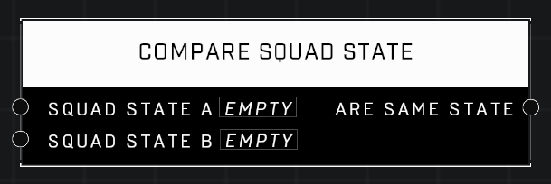

# Compare Squad State

## Description
Compares if Squad Combat States are the same

## Node Type
Nodes fall into two basic categories: Data and Execution. This node supplies Data for an Execution node.

## Inputs
| Input | Type | Required | Description |
|------------------|------------------|----------|--------------------------------------------------------------|
| Squad State A | Squad State | Yes | Squad State to compare to other input. |
| Squad State B | Squad State | Yes | Squad State to compare to other input. |

## Outputs
| Output | Type | Description |
|------------------|------------------|--------------------------------------------------------------|
| A == B | Boolean | Outputs TRUE if both Squad States are the same. |

\
\
**Contributors**

AddiCt3d 2CHa0s