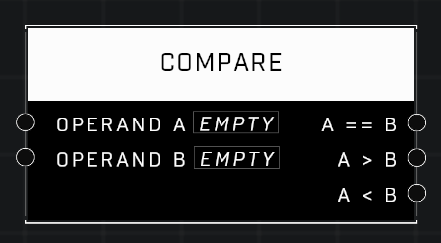

# Compare

## Description
Compares two numberic input values, returning true of false for each result

## Node Type
Nodes fall into two basic categories: Data and Execution. This node supplies Data for an Execution node.

## Inputs
| Input | Type | Required | Description |
|------------------|------------------|----------|--------------------------------------------------------------|
| Operand A | Number | Yes | Operand to compare against other input. |
| Operand B | Number | Yes | Operand to compare against other input. |

## Outputs
| Output | Type | Description |
|------------------|------------------|--------------------------------------------------------------|
| A == B | Boolean | Outputs TRUE if the numbers from both inputs are the same. |
| A > B | Boolean | Outputs TRUE if Operand A is greater than Operand B. |
| A < B | Boolean | Outputs TRUE if Operand A is less than Operand B. |

\
\
**Contributors**

AddiCt3d 2CHa0s