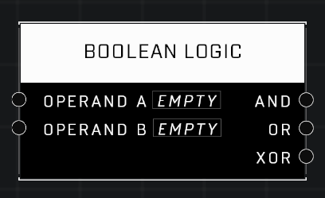

# Boolean Logic

## Description
Returns AND/OR boolean results in the input values

## Node Type
Nodes fall into two basic categories: Data and Execution. This node supplies Data for an Execution node.

## Inputs
| Input | Type | Required | Description |
|------------------|------------------|----------|--------------------------------------------------------------|
| Operand A | Boolean | Yes | Compares a Boolean to other input |
| Operand B | Boolean | Yes | Compares a Boolean to other input |

## Outputs
| Output | Type | Description |
|------------------|------------------|--------------------------------------------------------------|
| And | Boolean | Outputs TRUE if both Booleans are TRUE. |
| And | Boolean | Outputs TRUE if either or both Booleans are TRUE. |
| And | Boolean | Outputs TRUE if one Boolean is TRUE and one is FALSE or nil. |

\
\
**Contributors**

AddiCt3d 2CHa0s