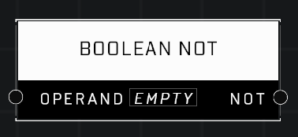

# Boolean NOT

## Description
Returns NOT boolean results on the input value. Nil input values are treated as FALSE and will return TRUE.

## Node Type
Nodes fall into two basic categories: Data and Execution. This node supplies Data for an Execution node.

## Inputs
| Input | Type | Required | Description |
|------------------|------------------|----------|--------------------------------------------------------------|
| Operand | Boolean | Yes | Reads boolean result from any node that outputs a boolean. |

## Outputs
| Output | Type | Description |
|------------------|------------------|--------------------------------------------------------------|
| Not | Boolean | Outputs TRUE if Operand boolean is FALSE or nil. |

\
\
**Contributors**

AddiCt3d 2CHa0s