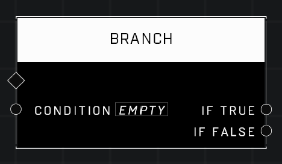

# Branch

## Description
Receives a boolean Condition and does one of two things if the Condition is true or false. Connect the If True and If False to the diamond of the pin you want to execute for each case.

## Node Type
Nodes fall into two basic categories: Data and Execution. This node Executes a function directly in the node string.

## Inputs
| Input | Type | Required | Description |
|------------------|------------------|----------|--------------------------------------------------------------|
| Condition | Boolean | Yes | Reads boolean result from any node that outputs a boolean. |

## Outputs
| Output | Type | Description |
|------------------|------------------|--------------------------------------------------------------|
| If True | Boolean | Runs nodes connected to this string if the boolean is TRUE. |
| If False | Boolean | Runs nodes connected to this string if the boolean is FALSE. |

\
\
**Contributors**

AddiCt3d 2CHa0s