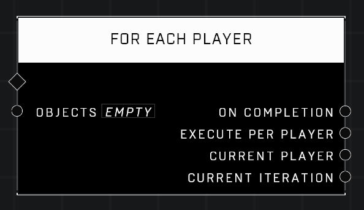

# For Each Player

## Description
Execute connected functions for each player in the Objects list. Identical to For Each Object except it ignores non-player objects in the list.

## Node Type
Nodes fall into two basic categories: Data and Execution. This node Executes a function directly in the node string.

## Inputs
| Input | Type | Required | Description |
|------------------|------------------|----------|--------------------------------------------------------------|
| Objects | Object List | Yes | Any list of objects. Non players will be ignored |

## Outputs
| Output | Type | Description |
|------------------|------------------|--------------------------------------------------------------|
| On Completion | Event | Continues node string after this node runs it's loop through the list. |
| Execute Per Player | Function | Runs attached nodes for each player in the list. |
| Current Player | Player | Outputs current player in the list. |
| Current Iteration | Number | Outputs the how many times the loop has run so far before completion. |

\
\
**Contributors**

AddiCt3d 2CHa0s