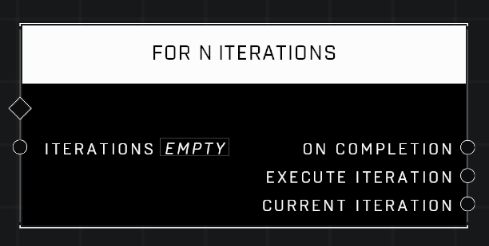

# For N Iterations

## Description
Execute connected functions the specified number of times

## Node Type
Nodes fall into two basic categories: Data and Execution. This node Executes a function directly in the node string.

## Inputs
| Input | Type | Required | Description |
|------------------|------------------|----------|--------------------------------------------------------------|
| Iterations | Number | Yes | How many times this loop will run. |

## Outputs
| Output | Type | Description |
|------------------|------------------|--------------------------------------------------------------|
| On Completion | Event | Continues node string after this node runs it's loops. |
| Execute Iteration | Function | Runs attached nodes for each iteration. |
| Current Iteration | Number | Outputs the how many times the loop has run so far before completion. |

\
\
**Contributors**

AddiCt3d 2CHa0s