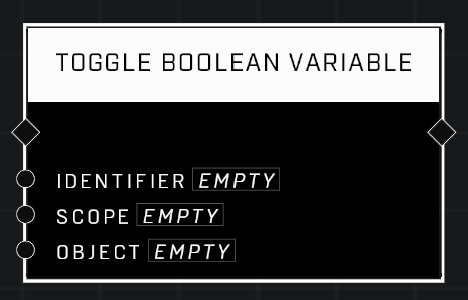

# Toggle Boolean Variable

## Description
Inverts the value of a Boolean variable. Equivalent to calling Get Boolean Variable and then calling Set Boolean Variable basd on the result. i.e., if it was FALSE, set it to TRUE. If it was TRUE, set it to FALSE.

## Node Type
Nodes fall into two basic categories: Data and Execution. This node Executes a function directly in the node string.

## Inputs
| Input | Type | Required | Description |
|------------------|------------------|----------|--------------------------------------------------------------|
| Identifier | String | Yes | Must match the Identifier of the Boolean Variable to toggle. |
| Scope | Scope | Yes | Must match the scope of the Boolean Variable to toggle. |
| Object | Object | No | Only used if Scope is Object. |

## Outputs
| Output | Type | Description |
|------------------|------------------|--------------------------------------------------------------|
| (none) | N/A  | N/A  |

\
\
**Contributors**

AddiCt3d 2CHa0s