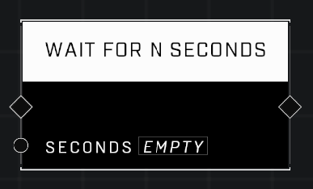

# Wait For N Seconds

## Description
Pause execution for the specified number of Seconds before continuing

## Node Type
Nodes fall into two basic categories: Data and Execution. This node Executes a function directly in the node string.

## Inputs
| Input | Type | Required | Description |
|------------------|------------------|----------|--------------------------------------------------------------|
| Seconds | Number | Yes | How many seconds to wait before continuing running nodes on the string. |

## Outputs
| Output | Type | Description |
|------------------|------------------|--------------------------------------------------------------|
| (none) | N/A  | N/A  |

\
\
**Contributors**

AddiCt3d 2CHa0s