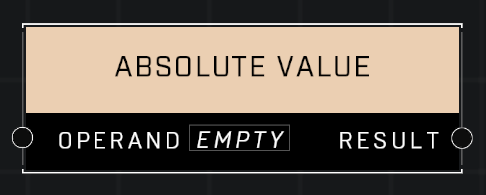

# Absolute Value

## Description
Returns the absolute value of the Operand

## Node Type
Nodes fall into two basic categories: Data and Execution. This node supplies Data for an Execution node.

## Inputs
| Input | Type | Required | Description |
|------------------|------------------|----------|--------------------------------------------------------------|
| Operand | Number | Yes | Operand to convert to absolute value. |

## Outputs
| Output | Type | Description |
|------------------|------------------|--------------------------------------------------------------|
| Result | Number | Outputs the absolute value, a whole non-negative number. |

\
\
**Contributors**

AddiCt3d 2CHa0s