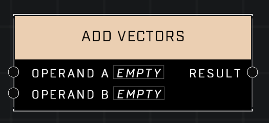

# Add Vectors

## Description
Returns the sum of two input vectors

## Node Type
Nodes fall into two basic categories: Data and Execution. This node supplies Data for an Execution node.

## Inputs
| Input | Type | Required | Description |
|------------------|------------------|----------|--------------------------------------------------------------|
| Operand A | Vector3 | Yes | Vector to add to other input. |
| Operand B | Vector3 | Yes | Vector to add to other input. |

## Outputs
| Output | Type | Description |
|------------------|------------------|--------------------------------------------------------------|
| Result | Vector3 | The result of both vectors added. |

\
\
**Contributors**

AddiCt3d 2CHa0s