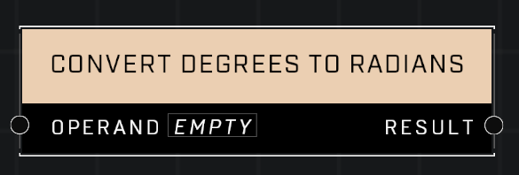

# Convert Degrees To Radians

## Description
Converts from degrees to radians

## Node Type
Nodes fall into two basic categories: Data and Execution. This node supplies Data for an Execution node.

## Inputs
| Input | Type | Required | Description |
|------------------|------------------|----------|--------------------------------------------------------------|
| Operand | Number | Yes | Degrees that will be converted to radians. |

## Outputs
| Output | Type | Description |
|------------------|------------------|--------------------------------------------------------------|
| Result | Number | Radians converted from given degrees. |

\
\
**Contributors**

AddiCt3d 2CHa0s