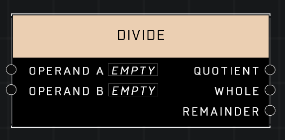

# Divide

## Description
Returns the quotient, whole number, and remainder of the two input values

## Node Type
Nodes fall into two basic categories: Data and Execution. This node supplies Data for an Execution node.

## Inputs
| Input | Type | Required | Description |
|------------------|------------------|----------|--------------------------------------------------------------|
| Operand A | Number | Yes | A number to be divided. |
| Operand B | Number | Yes | What to divide Operand A into. |

## Outputs
| Output | Type | Description |
|------------------|------------------|--------------------------------------------------------------|
| Quotient | Number | Outputs the result of Operand A divided by Operand B. |
| Whole | Number | The Quotient rounded to the nearest whole number. |
| Remainder | Number | The remainder left over after Operand A is divided by Operand B. |

\
\
**Contributors**

AddiCt3d 2CHa0s