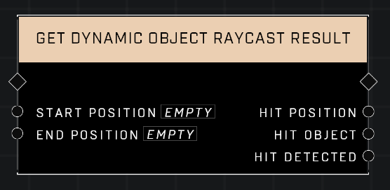

# Get Dynamic Object Raycast Result

## Description
Executes a physics raycast command that collides with dynamic objects.  

## Node Type
Nodes fall into two basic categories: Data and Execution. This node Executes a function directly in the node string.

## Inputs
| Input | Type | Required | Description |
|------------------|------------------|----------|--------------------------------------------------------------|
| Start Position | Vector3 | Yes | Position at which to start raycast. |
| End Position | Vector3 | Yes | Position at which to end raycast. |

## Outputs
| Output | Type | Description |
|------------------|------------------|--------------------------------------------------------------|
| Hit Position | Vector3 | Position where the raycast hits a dynamic object. |
| Hit Object | Object | Dynamic object, if any, that raycast collides with. |
| Hit Detected | Boolean | TRUE if raycast has collided with a dynamic object. |

\
\
**Contributors**

AddiCt3d 2CHa0s \
Okom \
Jordan9232